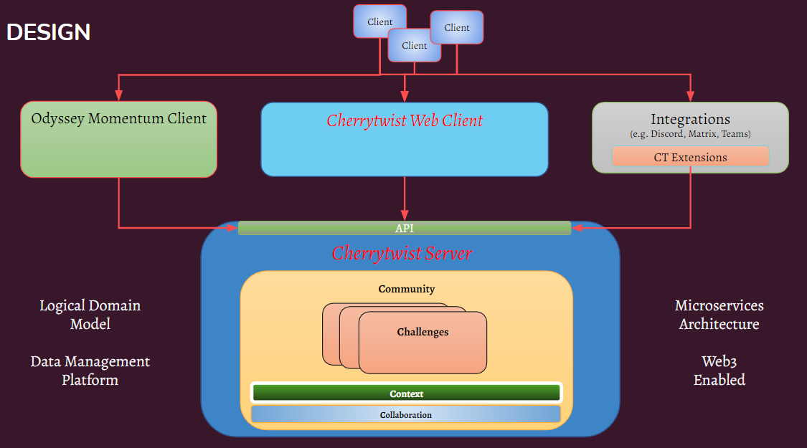

# Cherrytwist Server

Welcome to the Cherrytwist Server! This server is the heart of the Cherrytwist Platform, and manages the representation of the ecoverse and all the entities stored wthin it.

   

A high level overview of the Design of the Cherrytwist Server is shown below.

The server primarily interacts via a _*GraphQL api*_' that it exposes. This can be found at the following location: <http://localhost:4000/graphql> (assuming default port).

This api is used by the [Cherrytwist Web Client](http://github.com/cherrytwist/Client.Web), but also by any other clients / integrations that need to interact with the Cherrytwist server.

## **Additional information**:

- [Design - An overview of architectural layers and technologies used](docs/Design.md)
- [Running - How to run the Server using containers (docker-compose and docker)](docs/Running.md)
- [Developing - How to setup the Server for developing](docs/Development.md)
- [Configuration - The Server is responsible for managing the majority of the configuration for the Cherrytwist Platform.](docs/Configuration.md)
- [Data Management - How data representing the domain model used by Cherrytwist Platform is managed, including database migrations](docs/DataManagement.md)
- [Quality Assurance - Details of the test harness around the server and how to execute the test suites](docs/QA.md).
- [Pushing - How new docker images are published to Dockerhub](docs/Publishing.md)

For other questions / comments please feel free to reach out via the channels listed in the [Coordination Repo](http://github.com/cherrytwist/coordination).
