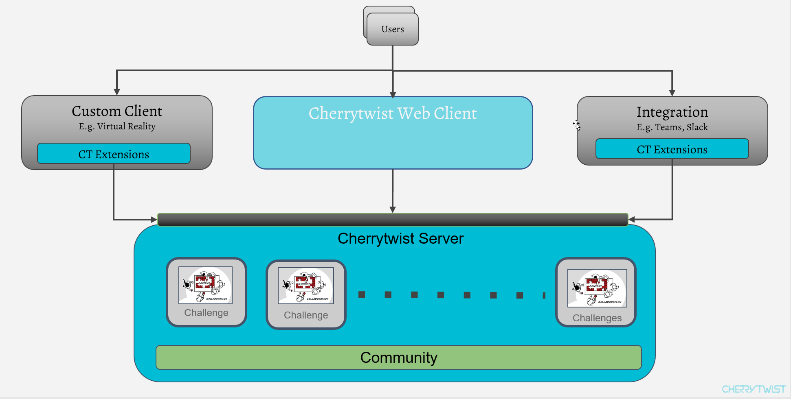

  

<i>Empowering society. The platform to succeed in working on challenges, together.</i>

# Alkemio Server

Welcome to the Alkemio Server! This server is the heart of the Alkemio Platform, and manages the representation of the Space and all the entities stored wthin it.

A high level overview of the Design of the Alkemio Server is shown below.

The server primarily interacts via a _*GraphQL api*_' that it exposes. This can be found at the following location: <http://localhost:4000/graphql> (assuming default port).

This api is used by the [Alkemio Web Client](http://github.com/alkem-io/client-web), but also by any other clients / integrations that need to interact with the Alkemio server.

The key takeaway is that the Alkemio server is designed to be integrated, so that other tools or user interfaces can make use of the logical domain model maintained by the server.

## **Additional information**:

- [Design - An overview of architectural layers and technologies used](docs/Design.md)
- [Running - How to run the Server using containers (docker-compose and docker)](docs/Running.md)
- [Developing - How to setup the Server for developing](docs/Developing.md)
- [Data Management - How data representing the domain model used by Alkemio Platform is managed, including database migrations](docs/DataManagement.md)
- [Quality Assurance - Details of the test harness around the server and how to execute the test suites](docs/QA.md).
- [Pushing - How new docker images are published to Dockerhub](docs/Publishing.md)

For other questions / comments please feel free to reach out via the channels listed in the [Alkemio Repo](http://github.com/alkem-io/alkemio).
