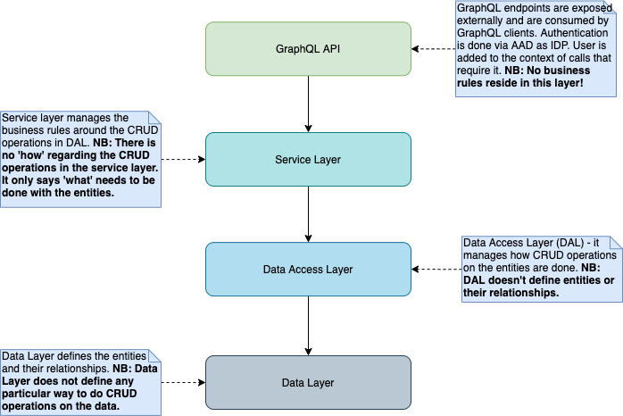

# Server

Represents the core back-end server that manages the representation of the ecoverse and all the entities stored wthin it.

[](https://travis-ci.com/cherrytwist/Server) [](https://coveralls.io/github/cherrytwist/Server?branch=server-627) [](https://bettercodehub.com/) 


## === Server architecture ===

Cherrytwist server uses [NestJS](https://nestjs.com/) as framework and complies to its principles. The code is split into Data Layer (entities), Data Access Layer (), Service Layer and an API Layer (GraphQL).
Interactions between different layers is depicted in the Layer Diagram below:




The technology stack is as follows:

- GraphQL: for specifying the interactions with the server, using Apollo server
- Node: for runtime execution - **NB: LTS Node version (12.8.3) is currently used for development, and is required for deployment.**
- NestJS as a framework
- TypeScript: for all logic
- TypeORM: for the orbject relational mapping
- mySQL: for data persistance
- docker: for containers
- docker-compose: for container orchestration
- passportjs for authentication
- Azure Active Directory as an Identity Provider
- Winston and Nest-Winston for logging
- Elastic Cloud + Kibana for centralized log management

## === Interacting with a Cherrytwist server ===
### **Graphql API**
The server primarily interacts via a GraphQL api that it exploses. This api is used by the [Cherrytwist Web Client](http://github.com/cherrytwist/Client.Web), but also by any other clients / integrations that need to interact with the Cherrytwist server.

This can be found at the following location: <http://localhost:4000/graphql>
(4000 is the default port, see below for information on adjusting this port)

### **Data Management**
For evaluation / development with the Cherrytwist server, there is also a simple Data Management panel, available at the following URL: <http://localhost:4000/data-management>.

The Data Management panel provides the following capabilities:
- **Empty Ecoverse**: Resets the database back to an empty state, and ensures there is an empty Ecoverse available. It is triggered by a http request to <http://localhost:4000/data-management/empty-ecoverse>, or alternatively by pressing the relevant button on the main Data Management panel.
- **Load Sample Data**: Loads a set of sample data into the Ecoverse. It is triggered by a http request to <http://localhost:4000/data-management/seed-data>, or alternatively by pressing the relevant button on the main Data Management panel.

Note: the sample data provided here is basic so users are encouraged to look also at the Demo project where additional and more extensive data loading capabilities are available.

## === Bootstrapping Ecoverse roles ===

In order to bootstrap Ecoverse profiles **first time**, do the following:

1. Set AUTH_ENABLED=false environment variable
1. If you are running an old version of the application (<0.3.*) do a Reset Ecoverse + Sample Data from the Data Management Panel.
1. Prepare a bootstrap json. Default json file is provided in src/utils/config/authorisation-bootstrap.json. If you'd like to change the name / location of the bootstrap file, set AUTH_BOOTSTRAP_PATH environment variable with the full path to your file.
1. Start the CT server. Your users and roles will be updated.

On every application restart afterwards the list of user and roles will be validated and roles will be re-added to the users based on the configuration.

**NB! The bootstrapping process creates only Profiles. It doesn't create accounts!.**

## === Running the server locally (not in a container) ===

To run the server a working MySQL Server is required.
For **MySQL 8** read [this](#MySQL-Server-specific-configuration-for-version-8).

### Configure the database connection

Default configuration is available. **DO NOT UPDATE `.env.default`**
If you need to specify different configuration, add .env file in project root folder and set values for MYSQL_DATABASE, MYSQL_ROOT_PASSWORD, DATABASE_HOST, GRAPHQL_ENDPOINT_PORT.
Note: Only AAD v2 endpoints and tokens are supported!

Example:

```conf
DATABASE_HOST=localhost
MYSQL_DATABASE=cherrytwist
MYSQL_ROOT_PASSWORD=toor
GRAPHQL_ENDPOINT_PORT=4000

```

Replace the content in [] with the guids from AAD - they can be retrieved from the Azure portal from the app registration page.
Optional variables:

- `MYSQL_DB_PORT` - specifies the MySQL port by default 3306.
- `ENABLE_ORM_LOGGING` -Enable/disable the internal ORM logging .

Example:

```conf
MYSQL_DB_PORT=55000
ENABLE_ORM_LOGGING=true
```

### Configure authentication

Define environment variables - e.g. locally in .env environment. Optionally provide AUTH_ENABLED=false for dev purposes (default value is TRUE) to test without AAD.

```conf
AUTH_AAD_TENANT=[tenant (directory) ID]
AUTH_AAD_CHERRYTWIST_API_APP_ID= [client (application) ID]
AUTH_AAD_MSGRAPH_API_SCOPE= [API Scopes Required for Downstream APIs, in our case Microsoft Graph API]
AUTH_AAD_MSGRAPH_API_SECRET=[App Client Secret obtained from cherrytwist-api app registration*]

AUTH_AAD_UPN_DOMAIN=[Domain name to be used when generating the UPN for accounts created on AAD by the platform]. Defaults to "playgroundcherrytwist.onmicrosoft.com", so a user gets a UPN like "first.last@playgroundcherrytwist.onmicrosoft.com". Note: the domain name specified needs to be either the default domain for the AAD tenant or a configured "verified domain name".
AUTH_ENABLED=true. Specifies whether authentication should be enabled on the CT Web Client and CT Server.
AUTH_AAD_CLIENT_APP_ID= The AAD app registrion client id of the Cherrytwist Web Client.
AUTH_AAD_CHERRYTWIST_API_SCOPE=[Cherrytwist API URI]./default - it is very important to have ./default after the API URI as this scope aggregates all the scopes of the Cherrytwist API and all downstream API scopes.
AUTH_AAD_CLIENT_LOGIN_REDIRECT_URI=The login redirect for the Cherrytwist Web Client.
```
***Disclaimer: The secret for the Cherrytwist playground environment is shared in .env.default. This is a playground environment and this secret is shared for demo purposes ONLY - make sure you always put your production variables in a safe place!**

Optionally configure CORS origin for improved security with the following env variable (by default the value is *):

```conf
CORS_ORIGIN=[your CORS origin value]
```

### Configure logging
To configure logging levels, use:

```conf
LOGGING_LEVEL_CONSOLE=Error|Warn|Verbose|Debug. Defaults to Error if no value is set. The logging level for the Winston console transports (logging to console).
LOGGING_LEVEL_ELK=Error|Warn|Verbose|Debug. Defaults to Error if no value is set. The logging level for the Elasticsearch transports (logging to Elastic Cloud).
AUTH_AAD_LOGGING_LEVEL=info|warn|error. Defaults to `error` if no value is set.
AUTH_AAD_LOGGING_LOG_PII=true|false. Default is false. Specifies whether AAD personal identifiable information can be logged.
ENABLE_ORM_LOGGING=true|false. Default is false. Specifies whether ORM logging should be enabled.
ENVIRONMENT=dev|test|acceptance|production. Current deployment environment. Used for managing / filtering logs on the Elastic Cloud / Kibana.
```

To configure profiling of the graphql api usage and performance, use:

```conf
LOGGING_PROFILING_ENABLED=true|false. Defaults to false if no value is set for performance reasons.
```

Note that profiling messages are set at Verbose level so the logging level does need to be at least at that level for the messages to be visible.

### Configure Elastic Cloud endpoint

To configure Elastic Cloud endpoint, use:

```conf
LOGGING_ELK_ENABLED=true|false. Default is false. Is logging to Elastic Cloud enabled?
ELASTIC_CLOUD_ID=Cloud ID of the Elastic Cloud instance.
ELASTIC_CLOUD_USERNAME=Elastic Cloud username.
ELASTIC_CLOUD_PASSWORD=Elastic Cloud password.
```

### Install dependencies

```bash
npm install
```

### Start the server

```bash
npm start
```

There should now be a running Cherrytwist server! It is possible to populate sample data into the server using the Data Management panel described above.

## === Running the server using containers (docker-compose and docker) ===

Prerequisites:

- Docker and docker-compose installed on x86 architecture (so not an ARM-based architecture like Raspberry pi)
- ports 80, 4000 (GRAPHQL_ENDPOINT_PORT) and 3306 free on localhost

To run this project:

1. Build the server image, pull mySQL image and start the containers

    ```bash
    docker-compose --env-file .env.docker up -d --build
    ```

    if .env file has been added use:

    ```bash
    docker-compose up -d --build
    ```
2. Validate that the server is running by visiting the [graphql endpoint](http://localhost:4000/graphql).

3. Optionally, populate database with initial data using the Data Management panel described above.

## === MySQL Server specific configuration for version 8 ===

MySQL version 8 by default use `caching_sha2_password` password validation plugin that is not supported by typeORM. The plugin must be changed to 'mysql_native_password'. It can be done per user or default for the server.

If the server is already up and running create new user:

```sql
CREATE USER 'nativeuser'@'localhost' IDENTIFIED WITH mysql_native_password BY 'password';
```

or alter existing one:

```sql
ALTER USER 'nativeuser'@'localhost' IDENTIFIED WITH mysql_native_password BY 'password';
```

For MySQL in docker:

```bash
docker run --name some-mysql \
-p 3306:3306 \
-e MYSQL_ROOT_PASSWORD=my-secret-pw \
-d mysql \
--default-authentication-plugin=mysql_native_password
```

## === Migrations ===

**NB! Migrations use TypeORM CLI. Dependencies and environment variables are not loaded using nestJs - you will need the mySQL configuration in .env file in order to run the migrations locally.**

Generate new migration with name 'migration_name' after schema change:

```bash
npm run migration:generate -n [migration_name]
```

To apply migrations:

```bash
npm run migration:run
```

To revert migrations:

```bash
npm run migration:revert
```

To show status of migrations and see which migrations are pending and which migrations have been applied:

```bash
npm run migration:show
```

**NB! Database synchronization is switched off and migrations are applied manually (or with scripts as part of the docker images). Running untested migrations automatically may result in a data loss!**

## === Pushing code the dockerhub ===

We have automated the creation and deployment of containers to docker hub via a github action. To automaticly trigger the build up to dockerhub the following steps should be taken:

- Ensure that the code that you would like to create the container from is pushed / merged into the `develop` branch.
- Create a github release and tag it with the appropriate version number ie. `v0.1.3`
- Go to github actions and view the `push to docker` action to see if everything ran correctly.


## === Testing ===

Initial version of integration tests is in place. To run them, look at the prerequisites, below:

- Used frameworks/packages [jest](https://jestjs.io/) and `supertest`
- Running `MySQL sql server`
- Running `Cherrytwist/Server` service.
- `AUTH_AAD_CLIENT_APP_ID`, `AUTH_AAD_CHERRYTWIST_API_SCOPE`, `AUTH_AAD_TENANT`, `AUTH_AAD_TEST_HARNESS_PASSWORD`, `AUTH_AAD_CHERRYTWIST_API_APP_ID`, `AUTH_AAD_MSGRAPH_API_SCOPE` and `AUTH_AAD_UPN_DOMAIN` env variables  must be provided for authenticated scenarios.
- `AUTH_ENABLED` env variable must be set to `true`.
- `AUTH_AAD_TEST_HARNESS_PASSWORD` and `AUTH_AAD_MSGRAPH_API_SECRET` secrets (also env variables) need to be provided
- In order to run the integration tests, navigate to the `/Server` repository, and execute the following command: `npm run test:e2e`
  - To run specific suite: `npm run-script test:e2e jest --config ./test folder>/<test suite file>` (i.e. `./test/user.e2e-spec.ts`)
- The results of the test, will be displayed at the end of the execution.

To run e2e tests with coverage:
- Use `npm run test:e2e-cov`

To debug tests in VS Code:
- Use `Debug Jest e2e Tests` configuration for API tests
- Use `Debug Jest CI Tests` configuration for CI tests
