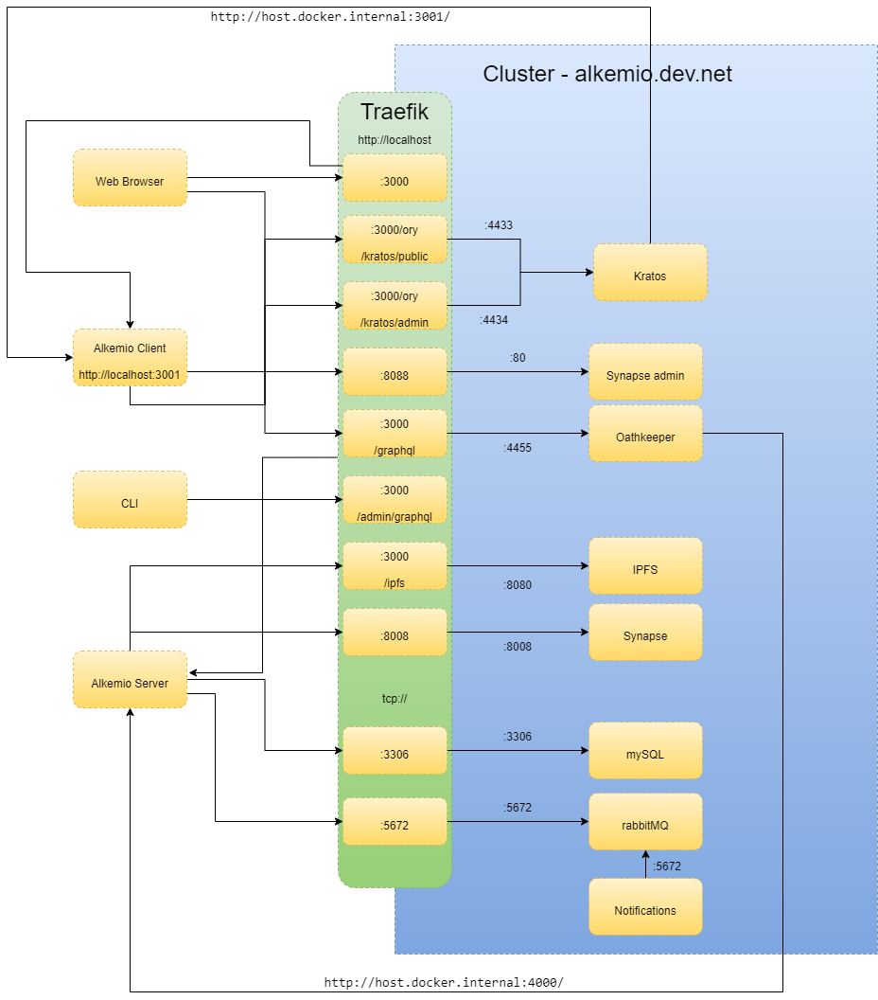

# Design

Alkemio Server uses [NestJS](https://nestjs.com/) as framework and complies to its principles. The code is split into Data Layer (entities), Data Access Layer, Service Layer and an API Layer (GraphQL).
Interactions between different layers is depicted in the Layer Diagram below:

# Network setup

The development stack of Alkemio uses docker-compose to build up the dependent development services. To accelerate development, alkemio server and alkemio client are left inside the host network and are bridged via traefik routes. The networking stack can be seen in the diagram below:

# Technology landscape

- GraphQL: for specifying the interactions with the server, using Apollo server
- Node: for runtime execution - **NB: LTS Node version (14.17.3) is currently used for development, and is required for deployment.**
- NestJS as a framework
- TypeScript: for all logic
- TypeORM: for the orbject relational mapping
- mySQL: for data persistance
- docker: for containers
- docker-compose: for container orchestration
- passportjs for authentication
- authentication providers: via one or the support authentication providers (e.g. Ory Kratos)
- Winston and Nest-Winston for logging
- Elastic Cloud + Kibana for centralized log management

## API Guidelines

The api has a set of conventions / design guidelines that all extensions are required to follow:

- Assign/Remove: for mutations that work on relations between two entities (e.g. User, UserGroup)
- All mutations are required to take a single Input object
- All Input objects are unique to a mutation i.e. they should not be re-used across mutations
- For Update mutations, it is allowed to cascade updates to child entities only in the case where there is a one-one relationship. If the relationship is one-many (e.g. References on Context, Actors in ActorGroups) then the child entities should be modified by mutations acting directly on the child entity (e.g. Reference).
- All mutations are required to have a description.
