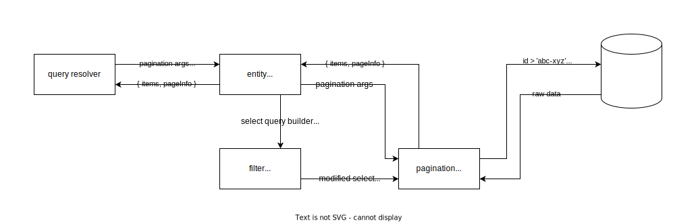

# Motivation

GraphQL enables you to fetch exactly the fields you need from your graph, with no unnecessary overhead.
This helps keep network responses small and fast.

However, GraphQL doesn't automatically guarantee small responses.
This is especially apparent when you query a field that contains a list.
A list can contain infinitely many elements, which can result in an enormous response from a seemingly small query.

If your graph includes thousands or millions of users, this query probably returns much more data than you need.
To resolve this issue, GraphQL servers can paginate their list fields.

### Cursor implementation

If offset pagination is an array, then cursor pagination is a linked list.
Where offset grabs records based on where they are located in the table like an index,
cursors use a pointer that points to a specific record and grabs the records following this specific record.

### Decisions

Sorting and fetching records conditionally based on UUIDs have proven slow over a large collection.
The easiest way to tackle this problem is sorting only by a unique sequential column - for this reason we introduce
a new column called 'rowId' which is AUTO_INCREMENT in nature.

### Pagination efficiency

The graph below shows the results of implementing four different types of pagination on a table containing 7.3 million records


At first glance, these results just seem wrong, but let’s dive deeper into what’s going on here.


- N refers to the whole data set (i.e. 7.3 million in this case
- W refers to the number of elements that meet the WHERE criteria.

# Pagination result

```json
{
  "data": {
    "usersPaginated": {
      "users": [
        {
          "nameID": "admin-alkemio"
        }
      ],
      "pageInfo": {
        "startCursor": "27391673-876b-4b18-b65b-f8c62cf75d76",
        "endCursor": "27391673-876b-4b18-b65b-f8c62cf75d76",
        "hasNextPage": true,
        "hasPreviousPage": false
      }
    }
  }
}
```

# Technical design



- A query is sent to the server and it's intercepted by a query resolver.
- Pagination args
  - after - A pivot cursor after which items are selected
  - first - Amount of items after the 'after' cursor
  - before - A pivot cursor before which items are selected
  - last - Amount of items before the 'before' cursor
- The entity service applies the filtering and then applies the pagination through a generic pagination function
- The pagination function is building SQL queries based on the provided pagination args,
  in order to retrieve the paged data and look around if data is available before or after the paged section
- Filter args -Dependant on the Entity. The arguments represent field names of the filtered Entity and are name, value pairs

# Usage

```graphql
{
  usersPaginated(first: 1, filter: { firstName: 'admin' }) {
    users {
      nameID
    }
    pageInfo {
      startCursor
      endCursor
      hasNextPage
      hasPreviousPage
    }
  }
}
```

# Apollo client

The client needs to implement a type policy for the paginated field in order to be
correctly written and then read from the cache
