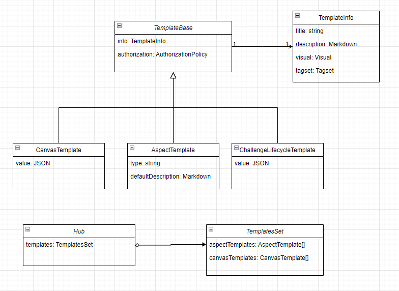
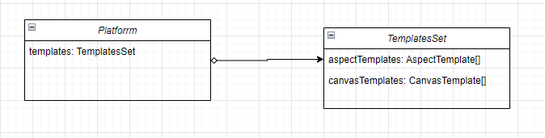

# Templates

The ability to create new content on Alkemio, based on a set of existing definitions, is referred to as **Templates**.

Some examples of where Templates are applicable in Alkemio include:

- Posts
- Whiteboards
- Lifecycles

The way it works is that within a given scope, typically a Challenge Hub, there are a set of Templates available. Then when a user wants to create a new instance of a particular entity, they chooose the Template and use it as a **template** for a new entity. In the example of a new Canvas, the user chooses the CanvaseTemplate they wish to use and then the user creates a new Canvas based on that Canvas. The original Canvas Template is not mofified, and the User can then work further on the new Canvas.

Templates provide the following key benefits:

- Allowing each Space to customize the environment
- Enabling the sharing of best practices in a systematic way.

This latter point is critical: demonstrating the vision of giving access to content to accelerate working effectively on Challenges.

## Scope

The initial scope for Template support covers:

- Post Templates
- Whiteboard Templates
- InnovationFlow Templates

Other templates types, such as Community setups, Classification Tagsets etc should all be able to build upon this initial work.

Out of scope:

- Managing versions of templates + the associated history. Note that Templates can over time evolve to be like an "AppStore" environment.

## Domain Templates

As Templates are a core mechanism for the platform, the Templates themselves should be part of the domain model. Each Space as such should be aware of the set of Templates that are available within the scope of that Space. This has to be data driven.

Each Template will have fields that are specific to that type of Template, but there will be shared meta-data information that is common to all Templates. The common information includes:

- **Title**: a visual title for the Template
- **Description**: the descriptive text for the Template
- **Visual**: a banner for the Template
- **Tagset**: a set of Tags for searching / classifying the Template

### Instantiation

For the initial implementation, the data in the Templates is **copied** when creating the new entity based on the Template i.e. there is no reference maintained to the original Template. This may later need to be maintained (e.g. licensing / usage of templates etc).

### Authorization

Each Template is Authorizable, which means that the AuthorizationPolicy for each Template can be set / updated independently of other Templates in the TemplatesSet.

## Platform Templates

The platform itself should make available a set of Templates for each Template type. These are in essence global Templates that can then be used to populate the set of Templates available within Challenge Hubs.

The management of Platform Templates is not part of the domain model, and could be done as a separate service. Ideally the Platform Templates should be data driven, but as this will be behind a particular facade the domain logic does not need to be aware of how the Platform templates are managed.

The Space admin then uses the Platform TemplatesSet to choose what Templates are available within the particular Space.
