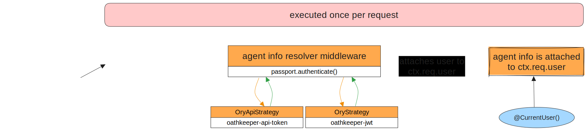

The three private endpoints go through Oathkeeper, which transforms the session cookie or API token to a bearer token.
The request then enters the collaboration service, where it goes through the middleware layer first. An authentication middleware is in place which has Passport.js running some predefined strategies. The sole purpose of the strategies is to validate the incoming identity in the form of a token.
The strategy does three main things:
- validates if the incoming token is valid
- checks if the token is associated with a user in `Kratos`
- resolves the User in the form of `AgentInfo`:
  - if it exists the `AgentInfo` is populated with information about the User in Alkemio
  - if it does NOT exist the `AgentInfo` is anonymous with minimal data

As soon as the strategy is executed, a callback is triggered in `Passport` with the resolved `AgentInfo`, errors and some extra information about the flow.
If there was an error, the request is blocked with an error to the requester.
If the validation is successful, the `AgentInfo` is attached to the `execution context`.

Since the `execution context` is available to decorators in runtime, we can use the `CurrentUser` decorator to extract the `AgentInfo` from the request in any resolver.
