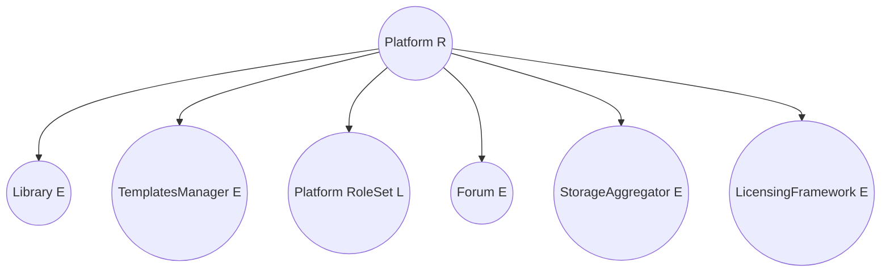
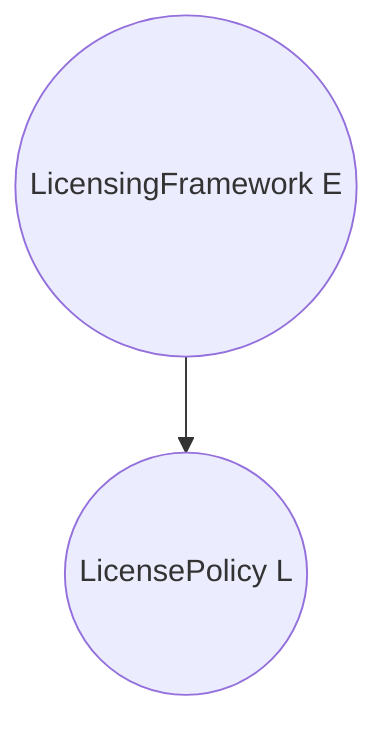
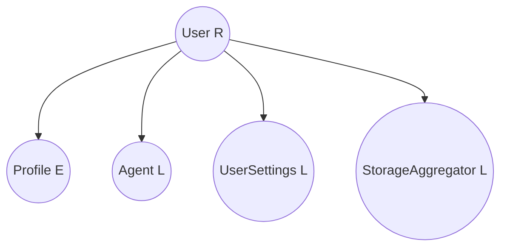
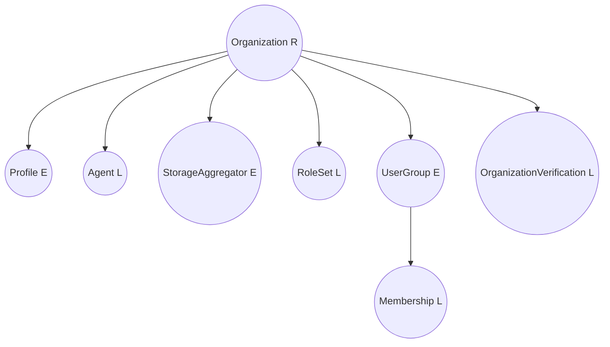
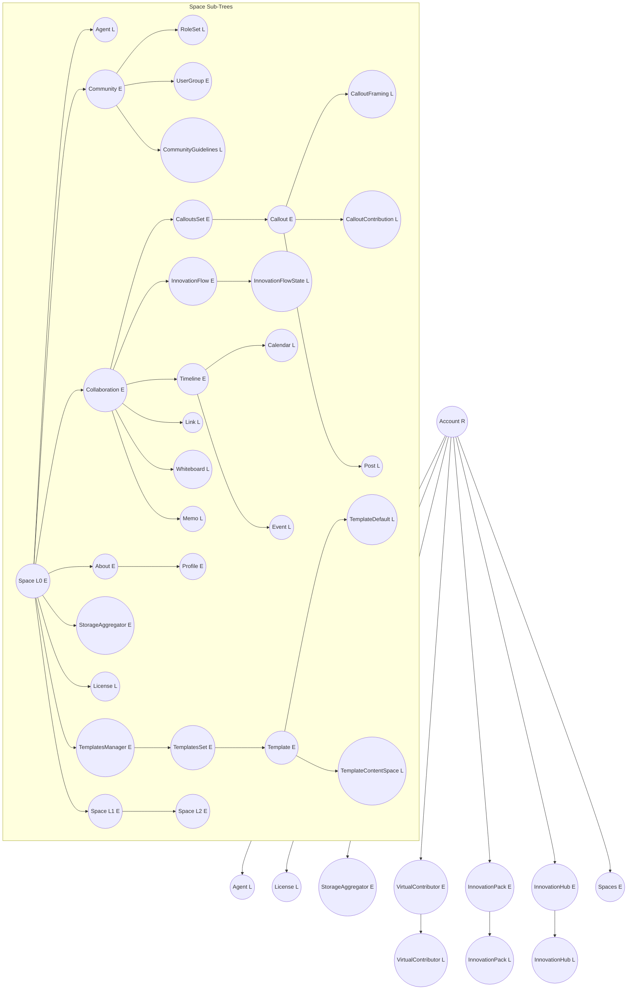
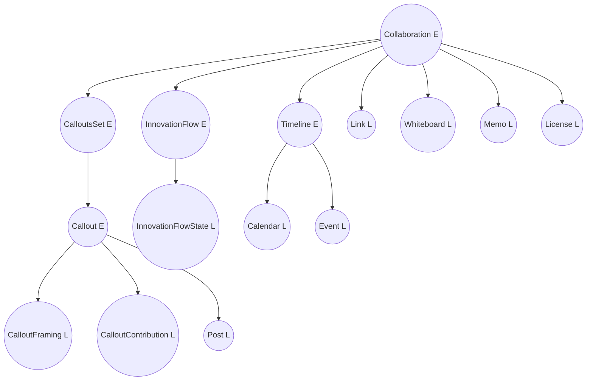
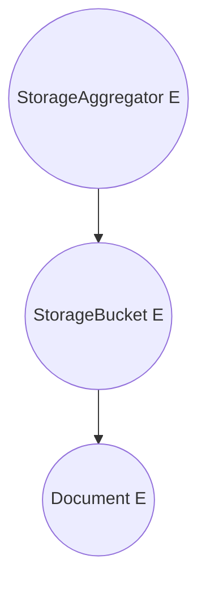
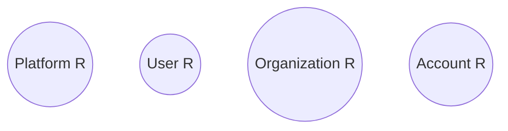

## Authorization Forest (Comprehensive)

This document provides a holistic, code-derived view of the complete authorization forest. It complements `credential-based-authorization.md` and replaces its earlier shallow diagrams.

Methodology (updated):

1. Enumerated every `*.service.authorization.ts` file.
2. For each service, analyzed its `applyAuthorizationPolicy` signature and body.
3. Classification rules (per current definitive definition):
   - (R) Root: `applyAuthorizationPolicy` does NOT accept a `parentAuthorization` (or never calls `inheritParentAuthorization`) and calls `inheritRootAuthorizationPolicy` (Platform/User/Organization/Account roots).
   - (E) Edge (non-root internal node): `applyAuthorizationPolicy` accepts a `parentAuthorization` (or receives one), calls `inheritParentAuthorization`, AND invokes at least one child `applyAuthorizationPolicy`.
   - (L) Leaf: `applyAuthorizationPolicy` accepts/uses `parentAuthorization` (calls `inheritParentAuthorization`) and does NOT invoke any other `applyAuthorizationPolicy` (no children).
4. Followed propagation to build directed graph; removed prior misclassification of Licensing Framework as root (it is an Edge under Platform).

Legend:

- (R) Root (no parent; starting point of a tree)
- (E) Edge (has parent + has children)
- (L) Leaf (has parent + no children)

> Some nodes internally create multiple authorization policies (e.g., sets vs items) but are represented once for clarity.

---

### 1. Platform Tree

Derived from `PlatformAuthorizationService.applyAuthorizationPolicy`.

Notes:

- `LicensingFramework` now classified as Edge: inherits from Platform and has child `LicensePolicy`.

### 2. Licensing Framework Branch (Edge)

### 3. User Tree

Typical structure from `UserAuthorizationService` (pattern inferred):

### 4. Organization Tree

### 5. Account Tree (with recursive Space sub-trees)

From `AccountAuthorizationService.applyAuthorizationPolicy` and recursive calls in `SpaceAuthorizationService`.

Recursion specifics:

- Each Space (L0 / L1 / L2) propagates to: Agent, Community (RoleSet, UserGroups, Guidelines), Collaboration (CalloutsSet, Callouts, InnovationFlow(+State), Timeline(+Calendar,+Event), Link, Whiteboard, Memo), About(Profile), StorageAggregator (→ Buckets → Documents), License.
- Only L0 attaches TemplatesManager (verified: guard in `SpaceAuthorizationService`).
- Profile nodes are classified as Edge (E) because `ProfileAuthorizationService.applyAuthorizationPolicy` inherits parent authorization and then invokes child apply logic for references, tagsets, visuals, and the storage bucket.

### 6. Collaboration Detail (Expanded)

From `CollaborationAuthorizationService` and its children:

### 7. Storage Detail

From `StorageAggregatorAuthorizationService`:

Note: `DocumentAuthorizationService.applyAuthorizationPolicy` inherits the parent policy, appends document-specific credential rules, and then applies authorization to its nested `tagset` (treating tagset as a child resource). This makes Document an Edge (E), not a Leaf.

### 8. Forest Overview (Roots Only)

### 9. Gaps & Assumptions

| Area                          | Assumption / To Validate                                                                                          |
| ----------------------------- | ----------------------------------------------------------------------------------------------------------------- |
| User / Organization leaves    | Based on typical pattern; confirm actual invocation file to ensure no missing sub-entities (e.g., Notifications). |
| Templates under non-L0 spaces | Not applied (current code path only at L0).                                                                       |
| AI Personas / Guidance        | If governed separately, add explicit edges from Platform (future refinement).                                     |
| Communication (Rooms)         | If attached under Community or Collaboration in future, extend diagrams.                                          |

### 10. Suggested Automation

Automate generation via AST analysis:

1. Parse each `*.service.authorization.ts` for `applyAuthorizationPolicy(` calls.
2. Build directed graph where edge A→B exists if service A invokes service B passing a child entity.
3. Detect roots as nodes with no inbound edges (except those explicitly marked with root inheritance helpers).
4. Emit Mermaid graph + diff vs previous snapshot for CI visibility.

### 11. Classification Summary

| Service                                      | Classification | Rationale                                                                             |
| -------------------------------------------- | -------------- | ------------------------------------------------------------------------------------- |
| PlatformAuthorizationService                 | R              | Calls `inheritRootAuthorizationPolicy`, no parent passed in                           |
| UserAuthorizationService                     | R              | Root inheritance, no parentAuthorization param                                        |
| OrganizationAuthorizationService             | R              | Root inheritance, no parentAuthorization param                                        |
| AccountAuthorizationService                  | R              | Root inheritance, no parentAuthorization param                                        |
| LicensingFrameworkAuthorizationService       | E              | Receives parent authorization from Platform; calls child LicensePolicy                |
| LicensePolicyAuthorizationService            | L              | Inherits parent, no further children (per code pattern)                               |
| SpaceAuthorizationService                    | E              | Takes optional parent, inherits, invokes child services + subspaces                   |
| CollaborationAuthorizationService            | E              | Inherits and invokes callouts, innovation flow, timeline, license                     |
| CalloutsSetAuthorizationService              | E              | Inherits and iterates callouts                                                        |
| CalloutAuthorizationService                  | E              | (Assumed) Inherits and invokes framing/contribution/posts                             |
| CalloutContributionAuthorizationService      | L              | (Assumed) No further apply calls                                                      |
| PostAuthorizationService                     | L              | Leaf content entity                                                                   |
| InnovationFlowAuthorizationService           | E              | Inherits then calls state/profile policies                                            |
| InnovationFlowStateAuthorizationService      | L              | Terminal state leaf                                                                   |
| TimelineAuthorizationService                 | E              | Inherits then calls calendar/event                                                    |
| CalendarAuthorizationService                 | L              | Leaf (no further calls)                                                               |
| EventAuthorizationService                    | L              | Leaf                                                                                  |
| StorageAggregatorAuthorizationService        | E              | Inherits, calls bucket                                                                |
| StorageBucketAuthorizationService            | E              | Inherits, iterates documents                                                          |
| DocumentAuthorizationService                 | E              | Inherits parent, extends tagset authorization (child: tagset)                         |
| ProfileAuthorizationService                  | E              | Inherits and invokes child apply calls (references, tagsets, visuals, storage bucket) |
| VisualAuthorizationService                   | L              | Leaf (no children)                                                                    |
| RoleSetAuthorizationService                  | L              | Inherits, no further apply calls                                                      |
| UserGroupAuthorizationService                | E              | Inherits and calls profile                                                            |
| OrganizationVerificationAuthorizationService | L              | Inherits, no children                                                                 |
| AgentAuthorizationService                    | L              | Inherits, no children                                                                 |
| LicenseAuthorizationService                  | L              | Inherits, no children                                                                 |

Last updated: 2025-10-15.
