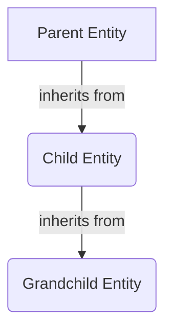
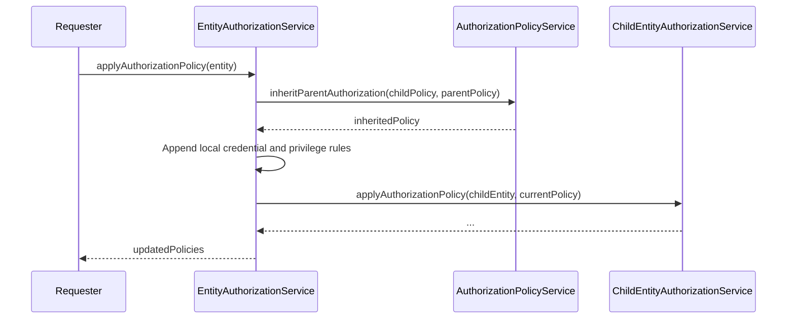
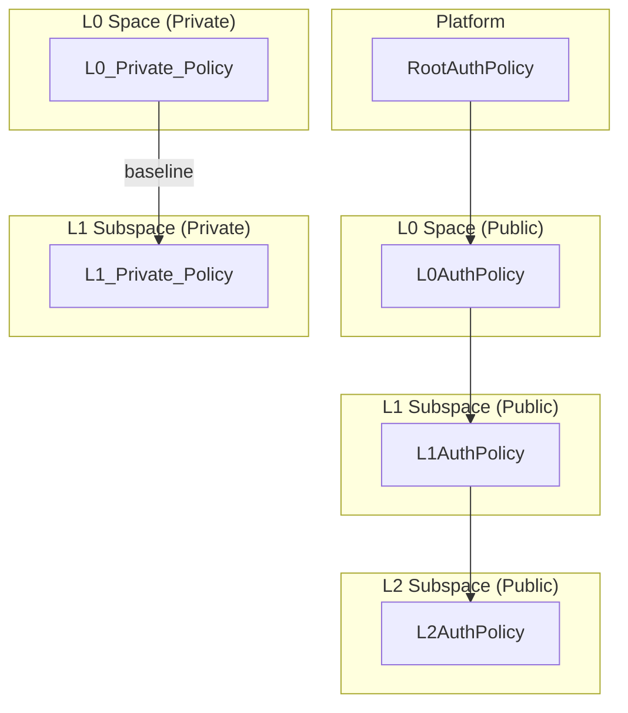

# Credential-Based Authorization System

This document outlines the architecture and flow of the credential-based authorization system. The system is designed to be hierarchical, with policies and permissions inherited from parent entities.

## Core Components

The authorization system is built around a few core components:

- **`AuthorizationPolicy`**: An entity that represents the set of authorization rules for a specific resource. It contains three types of rules:
  - `credentialRules`: Grants privileges based on the credentials held by an agent.
  - `privilegeRules`: Maps one privilege to another (e.g., granting `READ_ABOUT` if an agent has `READ`).
  - `verifiedCredentialRules`: Grants privileges based on verified credentials.
- **`AuthorizationPolicyService`**: A central service responsible for creating, managing, and applying authorization policies. It provides methods for inheritance, rule creation, and policy validation.
- **`*.service.authorization.ts`**: A pattern of service files dedicated to handling the authorization logic for a specific entity (e.g., `SpaceAuthorizationService`, `LicensingFrameworkAuthorizationService`). These services orchestrate the application of authorization policies.

## Policy Hierarchy and Inheritance

The system uses a hierarchical model where child entities inherit authorization policies from their parents. This is primarily handled by the `inheritParentAuthorization` method in `AuthorizationPolicyService`.

### Inheritance Flow

1.  **Reset Policy**: The child entity's existing authorization policy is first cleared of all rules.
2.  **Inherit Rules**: The `inheritParentAuthorization` method iterates through the parent's `credentialRules`. If a rule is marked with `cascade: true`, it is copied to the child's policy.
3.  **Append Specific Rules**: After inheritance, the entity's specific authorization service (`*.service.authorization.ts`) appends additional rules that are relevant only to that entity.

This flow ensures that permissions are consistently applied down the entity hierarchy.

## Policy Application Flow

The application of authorization policies is orchestrated by the `applyAuthorizationPolicy` method found in the various `*.service.authorization.ts` files. This method is responsible for applying the correct set of rules to an entity and its descendants.

### `applyAuthorizationPolicy` Steps

1.  **Load Entity**: The target entity and its related authorization components (like its current policy and parent's policy) are loaded from the database.
2.  **Reset and Inherit**: The entity's authorization policy is reset, and it inherits the cascading rules from its parent's authorization policy.
3.  **Append Local Rules**: Entity-specific credential rules are appended. This is where the unique permissions for the entity are defined.
4.  **Append Privilege Mappings**: Privilege rules are added to map existing privileges to others (e.g., `READ` implies `READ_ABOUT`).
5.  **Cascade to Children**: The `applyAuthorizationPolicy` method is recursively called for all child entities, passing the current entity's newly-defined policy as the parent authorization.

This process is illustrated in the following diagram:

## Space Authorization

The `SpaceAuthorizationService` is a key part of the system, handling the complex authorization logic for Spaces. The authorization rules for a Space depend on its level (`L0`, `L1`, `L2`), visibility (`PUBLIC`, `PRIVATE`), and privacy mode.

### Key Logic in `SpaceAuthorizationService`

- **`applyAuthorizationPolicy`**: Orchestrates the entire authorization flow for a space. It determines the parent authorization policy based on the space's level and privacy mode.
- **`resetToPrivateLevelZeroSpaceAuthorization`**: Provides the baseline set of rules for a private L0 space. This is the starting point for all private spaces. Public spaces inherit from their parent.
- **`getCredentialsWithVisibilityOfSpace`**: Determines which credentials are required to even "see" a space. This is crucial for filtering search results and preventing unauthorized access to space information.
- **Propagation**: After a space's policy is defined, it is propagated to all its child entities, including sub-spaces, the community, collaboration features, and storage.

### Space Hierarchy and Authorization

- **L0 Spaces**: These are top-level spaces. If private, they get a baseline set of rules. If public, they inherit from the platform's root authorization policy.
- **L1/L2 Spaces**: These are subspaces.
  - If the subspace is **private**, it follows the same logic as a private L0 space, getting a baseline set of rules.
  - If the subspace is **public**, it inherits its authorization policy from its parent space.

This is visualized in the diagram below:

This structure allows for fine-grained control over permissions while maintaining a clear and inheritable hierarchy.
