# Credential-Based Authorization System

This document outlines the architecture and flow of the credential-based authorization system. The system is designed to be hierarchical, with policies and permissions inherited from parent entities.

## Core Components

The authorization system is built around a few core components:

- **`AuthorizationPolicy`**: An entity that represents the set of authorization rules for a specific resource. It contains three types of rules:
  - `credentialRules`: Grants privileges based on the credentials held by an agent.
  - `privilegeRules`: Maps one privilege to another (e.g., granting `READ_ABOUT` if an agent has `READ`).
  - `verifiedCredentialRules`: Grants privileges based on verified credentials.
- **`AuthorizationPolicyService`**: A central service responsible for creating, managing, and applying authorization policies. It provides methods for inheritance, rule creation, and policy validation.
- **`*.service.authorization.ts`**: A pattern of service files dedicated to handling the authorization logic for a specific entity (e.g., `SpaceAuthorizationService`, `LicensingFrameworkAuthorizationService`). These services orchestrate the application of authorization policies.

## Policy Hierarchy and Inheritance

The system uses a hierarchical model where child entities inherit authorization policies from their parents. This is primarily handled by the `inheritParentAuthorization` method in `AuthorizationPolicyService`.

### Inheritance Flow

1.  **Reset Policy**: The child entity's existing authorization policy is first cleared of all rules.
2.  **Inherit Rules**: The `inheritParentAuthorization` method iterates through the parent's `credentialRules`. If a rule is marked with `cascade: true`, it is copied to the child's policy.
3.  **Append Specific Rules**: After inheritance, the entity's specific authorization service (`*.service.authorization.ts`) appends additional rules that are relevant only to that entity.

This flow ensures that permissions are consistently applied down the entity hierarchy.

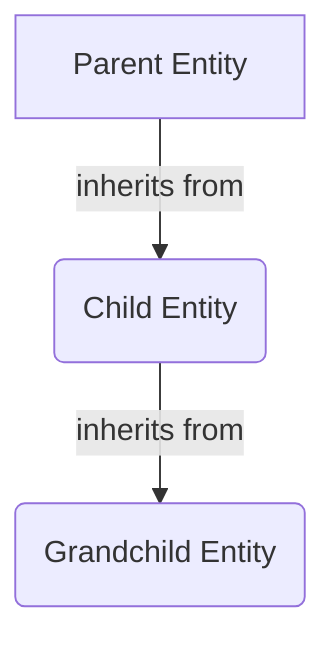

## Policy Application Flow

The application of authorization policies is orchestrated by the `applyAuthorizationPolicy` method found in the various `*.service.authorization.ts` files. This method is responsible for applying the correct set of rules to an entity and its descendants.

### `applyAuthorizationPolicy` Steps

1.  **Load Entity**: The target entity and its related authorization components (like its current policy and parent's policy) are loaded from the database.
2.  **Reset and Inherit**: The entity's authorization policy is reset, and it inherits the cascading rules from its parent's authorization policy.
3.  **Append Local Rules**: Entity-specific credential rules are appended. This is where the unique permissions for the entity are defined.
4.  **Append Privilege Mappings**: Privilege rules are added to map existing privileges to others (e.g., `READ` implies `READ_ABOUT`).
5.  **Cascade to Children**: The `applyAuthorizationPolicy` method is recursively called for all child entities, passing the current entity's newly-defined policy as the parent authorization.

This process is illustrated in the following diagram:

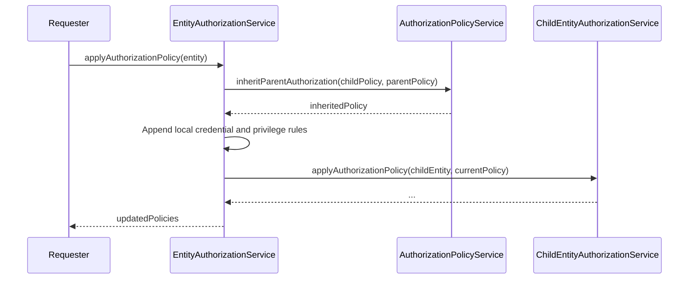

## Visibility: The First Layer of Authorization

Before any privileges (`READ`, `UPDATE`, etc.) are checked, the system first determines if an entity is **visible** to the requesting agent. Visibility is the foundational layer of authorization. If an agent cannot "see" an entity, they cannot perform any actions on it, regardless of other permissions they might have.

This is primarily handled by methods like `getCredentialsWithVisibilityOfSpace` in the `SpaceAuthorizationService`.

### How Visibility Works

1.  **Determine Required Credentials**: The service calculates the set of credentials required to see a specific entity. For a `Space`, this depends on its level, privacy mode, and its parent's properties. For example, to see a private space, an agent typically needs a `SPACE_MEMBER` credential for that space.
2.  **Grant `READ_ABOUT` Privilege**: The credentials gathered in the previous step are then used to create an authorization rule that grants the `READ_ABOUT` privilege. This privilege allows an agent to see the existence of the entity and its basic, non-sensitive information.
3.  **Filter Queries**: This visibility check is crucial for filtering lists of entities. When a user requests a list of spaces, the system only returns the spaces for which the user has at least `READ_ABOUT` privilege.

The `SpaceVisibility` enum (`ACTIVE`, `DEMO`, `ARCHIVED`) and `SpacePrivacyMode` (`PUBLIC`, `PRIVATE`) are key inputs into this process, dictating how the credential rules for visibility are constructed. For instance, a `PUBLIC` space's visibility rules will be much broader than a `PRIVATE` space's.

In essence, you can think of the authorization process as two questions:

1.  **Can you see it?** (Visibility / `READ_ABOUT`)
2.  **What can you do with it?** (Privileges / `READ`, `UPDATE`, `DELETE`, etc.)

## Roles, RoleSets, and Communities

While visibility and policies define the "what" and "where" of authorization, the "who" is determined by Roles, RoleSets, and Communities. These components work together to assign credentials to users, which are the ultimate key to unlocking privileges.

- **Community**: Every Space has an associated Community, which is essentially the group of users related to that space.
- **RoleSet**: Each Community has a RoleSet, which defines the possible roles users can have within that community (e.g., Admin, Member, Lead).
- **Role Assignment**: When a user is added to a Community, they are assigned a specific role from the RoleSet.
- **Credential Granting**: Being assigned a role grants the user a corresponding `AuthorizationCredential`. For example, a user with the `ADMIN` role in a space's community receives the `SPACE_ADMIN` credential for that specific space.

This relationship is the bridge between a user's identity and their permissions. The authorization policies don't check for users directly; they check for the credentials that users hold.

### The Two-Phase Authorization Process

You are correct to point out that the process is not a single, linear flow. It operates in two distinct phases: **Policy Configuration** (a "write-time" operation) and **Access Evaluation** (a "run-time" operation).

#### 1. Policy Configuration Flow

This flow occurs when an entity is created or its authorization-related settings are modified. It's the process of defining and saving the rules for an entity _before_ any access requests are made. The `applyAuthorizationPolicy` method is the heart of this flow.

1.  An event triggers an authorization update (e.g., creating a space, changing a space's privacy).
2.  The relevant `*.service.authorization.ts` calls `applyAuthorizationPolicy`.
3.  The service determines the correct parent policy, inherits its rules, and appends new, entity-specific rules.
4.  The final, complete `AuthorizationPolicy` is saved to the database, associated with the entity.

This process pre-calculates and stores the rules. It answers the question: **"What are the rules for this entity?"**

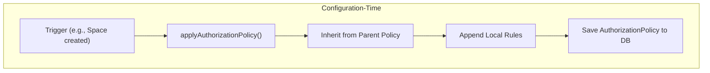

#### 2. Access Evaluation Flow (Runtime)

This flow occurs every time a user attempts to perform an action that requires authorization. It's a fast, read-only check against the pre-configured policies.

1.  A **User** with an assigned **Role** (e.g., "Admin") holds a set of **Credentials** (e.g., `SPACE_ADMIN`).
2.  The user attempts an action (e.g., `updateSpace`).
3.  The system's authorization guard retrieves the `AuthorizationPolicy` for the target space from the database.
4.  The guard uses the `AuthorizationService` to check if the user's credentials grant the required privilege (`UPDATE`) according to the rules in the retrieved policy.
5.  Access is either granted or denied.

This process answers the question: **"Does this user's set of credentials satisfy the rules for this entity?"**

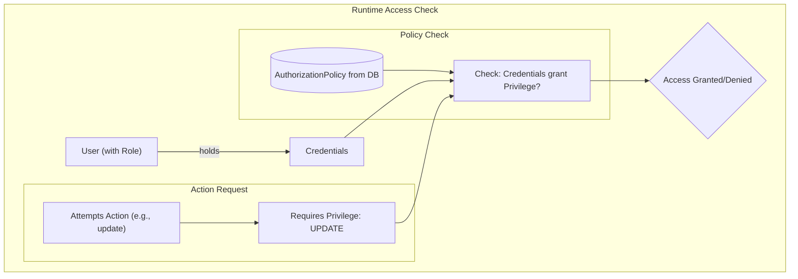

## Space Authorization

The `SpaceAuthorizationService` is a key part of the system, handling the complex authorization logic for Spaces. The authorization rules for a Space depend on its level (`L0`, `L1`, `L2`), visibility (`PUBLIC`, `PRIVATE`), and privacy mode.

### Key Logic in `SpaceAuthorizationService`

- **`applyAuthorizationPolicy`**: Orchestrates the entire authorization flow for a space. It determines the parent authorization policy based on the space's level and privacy mode.
- **`resetToPrivateLevelZeroSpaceAuthorization`**: Provides the baseline set of rules for a private L0 space. This is the starting point for all private spaces. Public spaces inherit from their parent.
- **`getCredentialsWithVisibilityOfSpace`**: Determines which credentials are required to even "see" a space. This is crucial for filtering search results and preventing unauthorized access to space information.
- **Propagation**: After a space's policy is defined, it is propagated to all its child entities, including sub-spaces, the community, collaboration features, and storage.

### Space Hierarchy and Authorization

- **L0 Spaces**: These are top-level spaces. If private, they get a baseline set of rules. If public, they inherit from the platform's root authorization policy.
- **L1/L2 Spaces**: These are subspaces.
  - If the subspace is **private**, it follows the same logic as a private L0 space, getting a baseline set of rules.
  - If the subspace is **public**, it inherits its authorization policy from its parent space.

This is visualized in the diagram below:

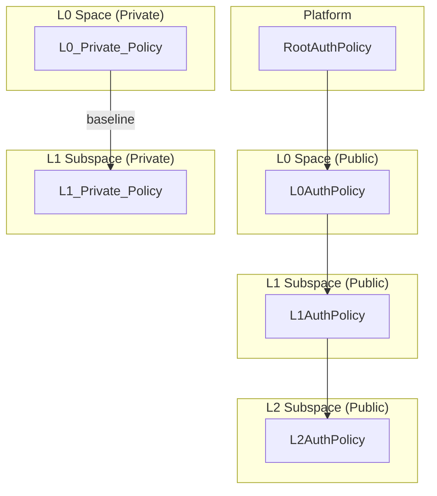

This structure allows for fine-grained control over permissions while maintaining a clear and inheritable hierarchy.

## The Authorization Forest: A Deterministic View

**Any entity whose authorization service calls `inheritRootAuthorizationPolicy` (after a reset, with no parent passed in) is the root of a tree in the authorization forest.**

Based on this deterministic rule, the true roots (explicit root services) are:

1.  **Platform** (`PlatformAuthorizationService`)
2.  **User** (`UserAuthorizationService`)
3.  **Organization** (`OrganizationAuthorizationService`)
4.  **Account** (`AccountAuthorizationService`)
5.  **AiServer** (`AiServerAuthorizationService`) – promoted to root after analysis showed it performs a root-style reset + credential seeding independent of the other roots.

The **Licensing Framework is NOT a root**: its authorization (`LicensingFrameworkAuthorizationService`) always inherits from the Platform's policy (it is invoked from `PlatformAuthorizationService.applyAuthorizationPolicy`). It therefore belongs to the Platform tree.

A **Space is never a root**. A public space inherits from its parent (another space or an account). A private space's policy is still rooted in its parent **Account**, not the global platform root, even though it may rebuild baseline rules.

For a full, always-up-to-date structural view (including collaboration & storage expansions), see: `authorization-forest.md`.

### 1. The Platform Tree

The Platform is the ultimate root. Its authorization service calls `inheritRootAuthorizationPolicy` and its policy is inherited by top-level platform entities such as the Library, Templates Manager, Forum, Licensing Framework, global RoleSet, and Platform-level Storage.

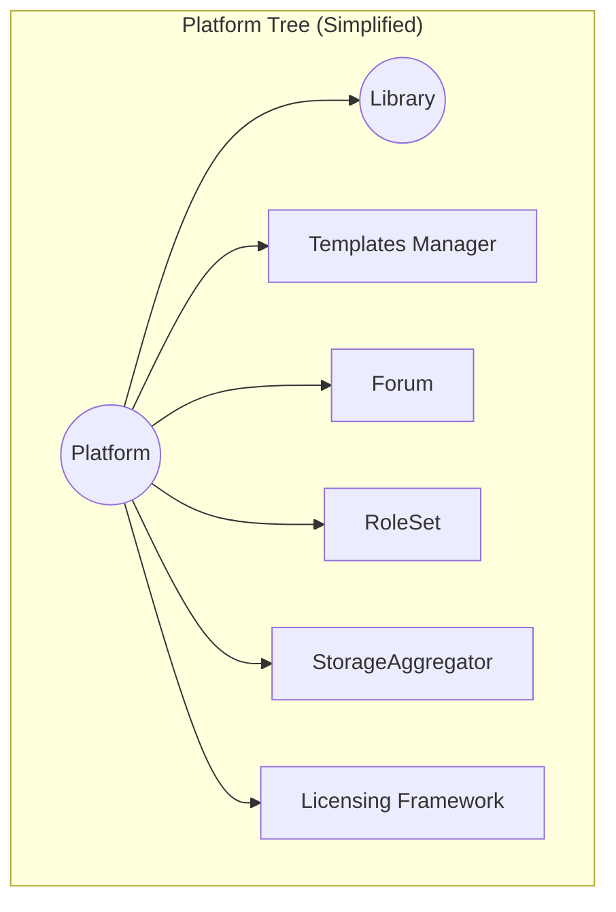

For deeper branch expansion (e.g., Licensing Framework → License Policy, Storage → Buckets → Documents), see `authorization-forest.md`.

### 2. The Authorization Trees (Complete Hierarchies)

The following diagrams show the complete, explicit hierarchies for each authorization tree root. The structure is determined by which child services have their `applyAuthorizationPolicy` method called by the parent service.

#### User Tree

A `User` is the root of a tree containing its `Profile`, `Agent`, `UserSettings`, and `StorageAggregator`.

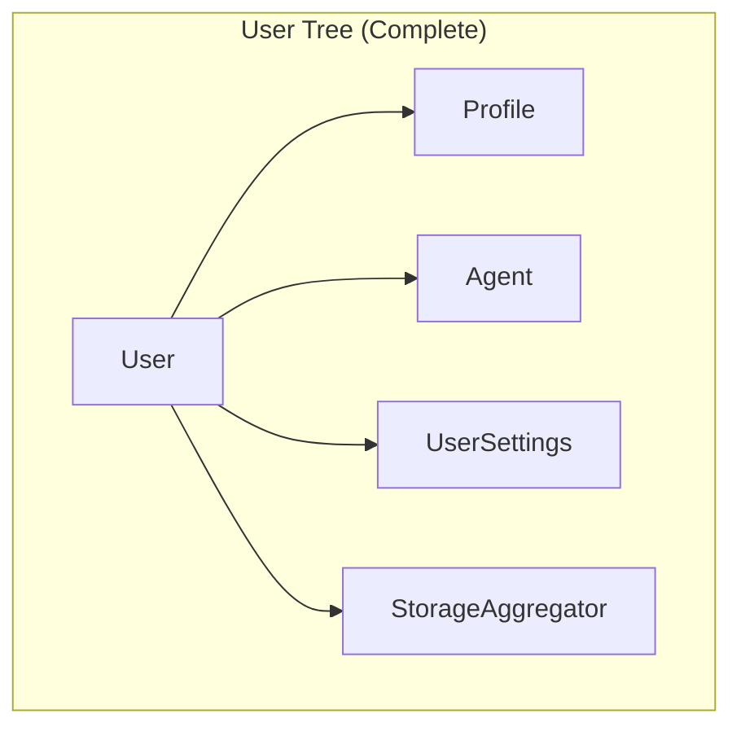

#### Organization Tree

An `Organization` is the root of a tree containing its `Profile`, `Agent`, `StorageAggregator`, `RoleSet`, `UserGroups`, and `OrganizationVerification`.

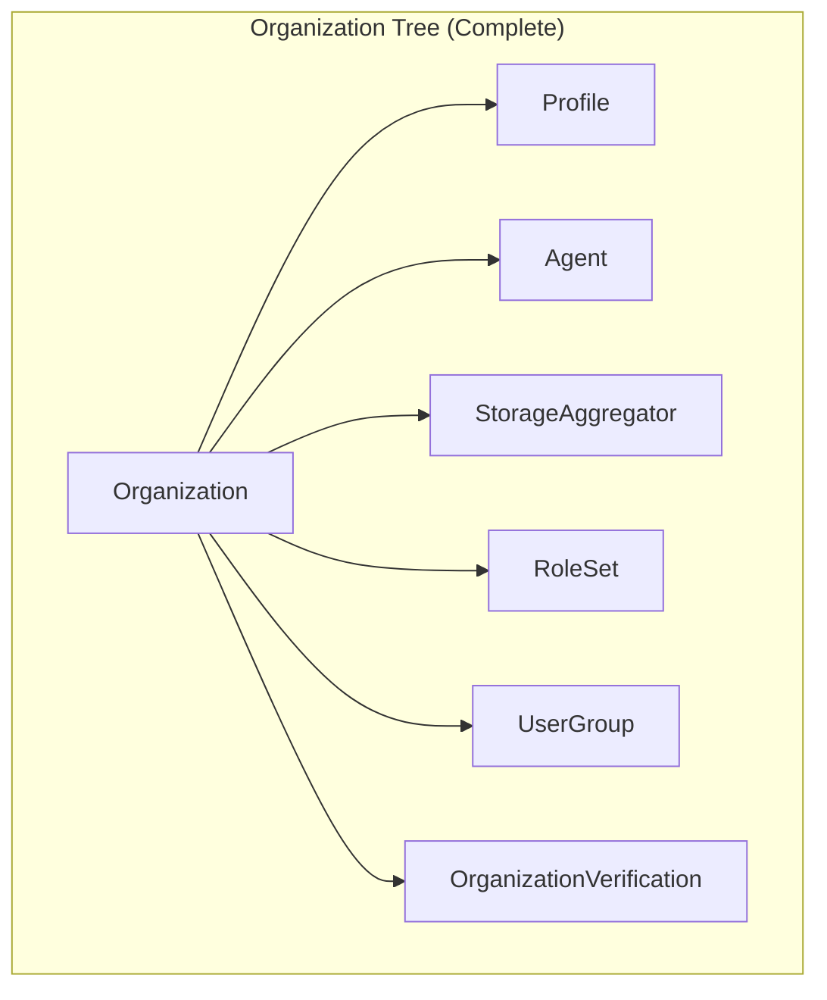

#### Account & Space Tree (Recursive)

An `Account` is the root of a complex tree. The `Space` entity within this tree is itself the root of a recursive sub-tree, containing its own children. The diagram below illustrates this complete, recursive hierarchy.

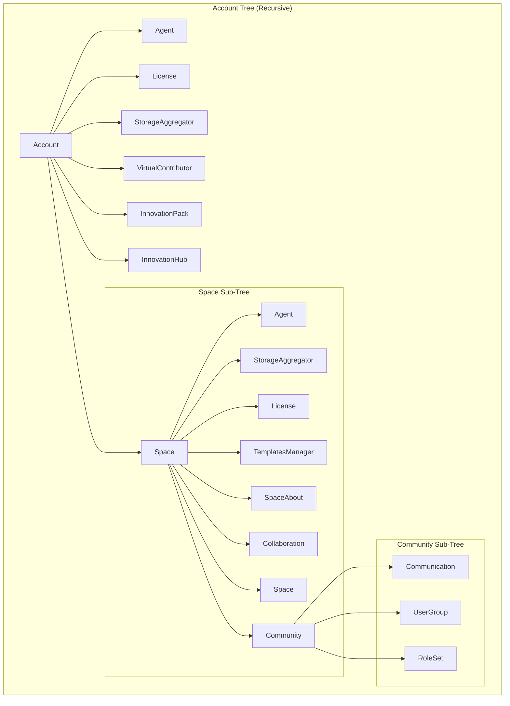

#### Licensing Framework Branch (Under Platform)

The `LicensingFramework` authorization policy inherits from Platform (not a root). Its local subtree:

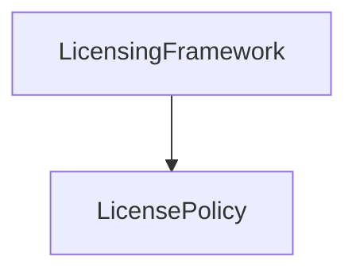

### 3. The Complete Forest (Roots Overview)

The complete authorization landscape is a forest composed of these distinct, deterministically-defined trees. (Edges/Leaves omitted here for brevity.)

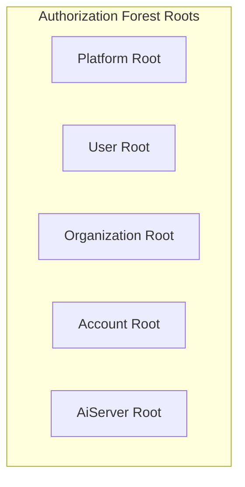

Licensing Framework is an Edge under Platform (not a root). AiServer stands alone as its own root cascading to AiPersonas.

### 4. Classification Alignment

The diagrams in this document are synchronized with the authoritative `authorization-forest.md`, which classifies every authorization service deterministically:

- (R) Root: Calls `inheritRootAuthorizationPolicy`, no parent passed.
- (E) Edge: Inherits parent (`inheritParentAuthorization`) and invokes at least one child `applyAuthorizationPolicy`.
- (L) Leaf: Inherits parent and invokes no further child `applyAuthorizationPolicy`.

For the exhaustive per-service classification table and expanded sub‑trees (Collaboration, Knowledge Base, Profile internals, Calendar → Event, Storage chains, Virtual Contributor & AI), refer to `authorization-forest.md`.
