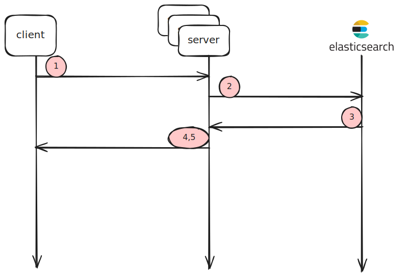
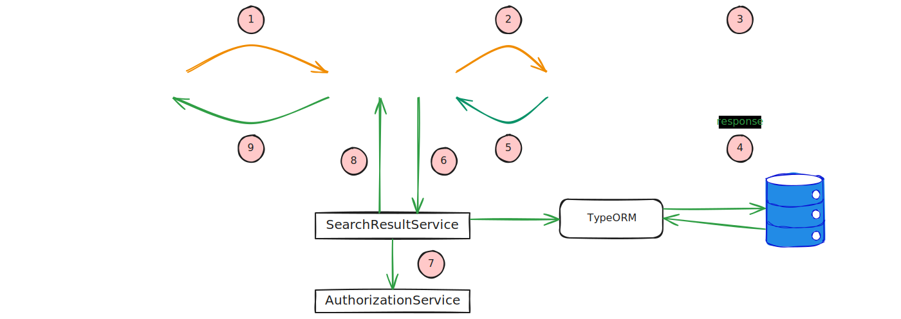
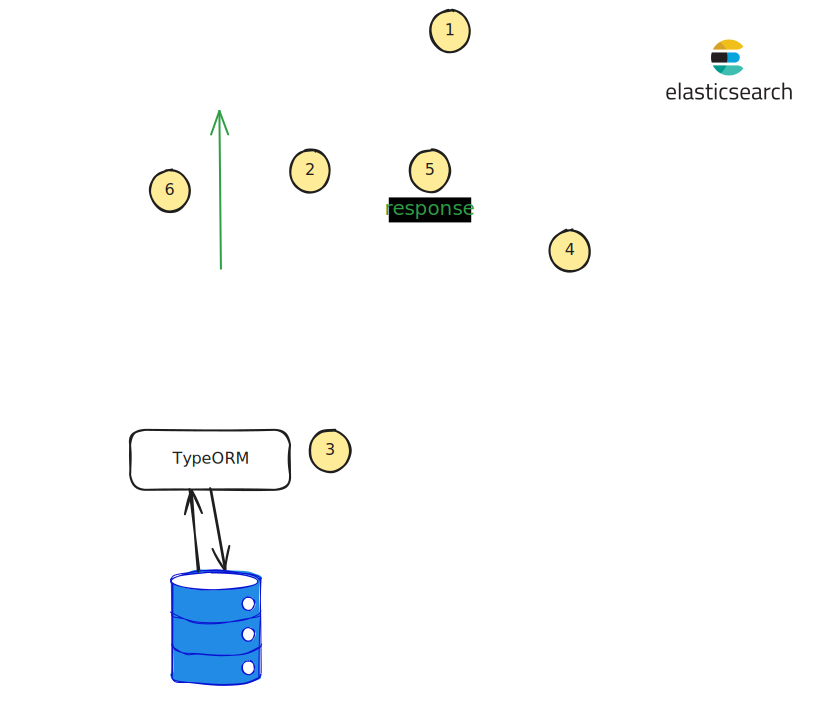

# High level system design


1. The client does a search request with terms and which types entities to return, e.g. Contributors - User, Organization.
2. The server transforms this request to an Elasticsearch query using the Query DSL. In addition it applies a score function to change the final score of the returned documents based on predefined filters.
3. Elastic returns the results in form on document array, each per record in the database.
4. Each of the returned document is authorized and then enriched with data, specific to the entity type.
5. Metadata is attached to each result, like score and an identifier.

# Server detailed design and implementation

1. Search query with input filter .
2. The search service is using both the extract service to perform a search, using Elasticsearch, and the result service, to return the results to the client using the GraphQL schema.
3. builds a query based on the input filters and uses Elasticsearch Query DSL.
   A score function is also defined, which applies custom scoring over the filtered (returned) documents.
4. The returned documents from Elastic are mapped to a simple base object, with some metadata like score, identifiers, etc.
5. Mapped search results are returned back to Search2Service
6. Search2Service is using SearchResultService to enrich the raw documents from Elastic. This also includes helper fields, like the Space, Challenge, Opportunity for a Post. Consult the GraphQL schema for all the available fields.
7. Each already enrich document (entity) is authorized against the user who is searching. The user needs the READ privilege in order to have access to the entity.
8. All the results are compiled in a few categories, ordered by score, and sent back to Search2Service.
9. Search2Service passes the results from the past steps as is.

# Ingest detailed design and implementation

1. The server tries to delete the indices if they exist
2. SearchIngestService is used to ingest a subset of data.
3. The data is loaded fom the Alkemio database using TypeORM.
4. Data is ingested in a single bulk request PER entity type.
5. The response from Elastic is checked thurougly for problems. Problems are logged and the results and errors are mapped to a typed object.
6. SearchIngestService returnes a mapped result object, consisting of all the successes and problems related to the ingest process.
Partial ingested data can occur. Errored documents can be re-ingested in a later stage if the problem was not blocking.

# The problem
Searching in everything based on the same terms is logical.
To avoid querying too much data, we are forced to have a cut-off point to limit the amount of results we have to process.
Since we are searching in everything, we have to score the results globally. The downside is that entities with a lot of context  (i.e Space) have the advantage of having more matches (higher score) - that means that entities with less context (i.e. User) will be matched less (lower score). Because of the cut-off point we introduced, less fortunate entities may be discarded even though they are relevant.


# Solution
Levariging [Multi search API](https://www.elastic.co/guide/en/elasticsearch/reference/current/search-multi-search.html) to search in multiple types of resources at the same time, by forming similar clusters (categories), will let us score the results locally to the cluster (category).
**By scoring results locally to its category, we can present equally more and relevant results to the user by category.**

## API
- `filters?: SearchFilterInput[]` added to `SearchInput`.

```typescript
SearchFilterInput :  {
  category!: SearchCategory
  cursor?: string;
  size!: number
  types?: SearchResultType[];
}[]
```
- Each filter is used to query Elasticsearch per category of resources
- You can define a filter per `category`.
- If you skip the filters, the default is used instead - search in everything.
- if you define one filter and skip the rest, Elastic will be queries only with that filter (category).
- The `cursor` is used to retrieve the next page of results with a certain page`size`. When you query for the first time, the result will return a unique cursor per category - put it in your next search query to receive the next page.
> :warning: Important: If you do not define any filters, you will receive 4 per category.
There is a max result amount you can receive and the sum of all sizes for all categories cannot exceed that threshold.

- You can further filter the results by defining which specific `types` you want to receive.

## Cursor implementation
- **represents a position in a sorted list of results**.
- implemented according to [this article](https://www.elastic.co/guide/en/elasticsearch/reference/current/paginate-search-results.html#search-after).
- a concatenated string of a score and a UUID, separated by `::`.
- The score is used for pagination, e.i. "_Give me the next X results after the score Y in decreasing order. Also use the `id` field to break ties._", where:
  -  `X` is the value of the `size` argument
  -  `Y` is the value of the `score` for a specific result.
  - The tiebreaker field is used to break ties between results with the same score.
