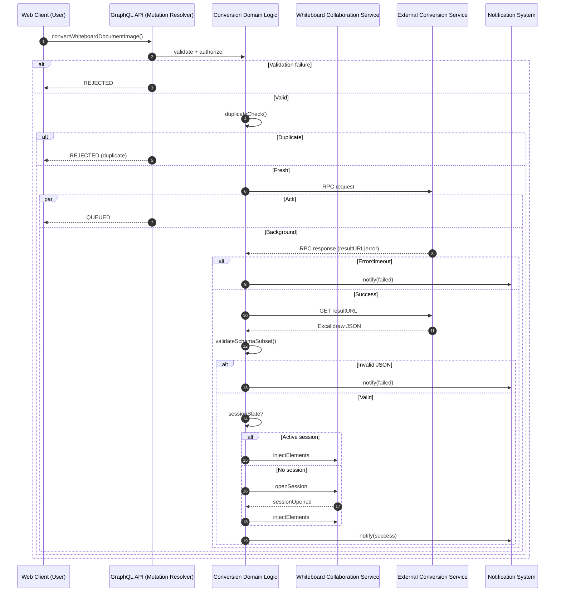

# Interaction Diagram: Whiteboard Image Document Conversion

Derived from `spec.md` (FR-001..FR-020, Clarifications Session 2025-10-04).

## Purpose

This diagram visualizes the end-to-end flow of the conversion feature, separating:

- Fast submit acknowledgment path (≤3s) vs background processing (≤5m)
- Alternate whiteboard update paths (active session vs session auto-open)
- Notification dispatch on completion/failure
- Failure handling (validation, duplicate in-progress, RPC error, invalid result)

## Participants

| Label | Component                        | Notes                                                     |
| ----- | -------------------------------- | --------------------------------------------------------- |
| U     | Web Client                       | Initiates mutation; receives queued ack only              |
| GQL   | GraphQL API Resolver             | Input boundary and initial validation handoff             |
| BL    | Conversion Domain Logic          | Orchestrates validation, RPC, state updates, metrics      |
| EXT   | External Conversion Service      | Performs image → Excalidraw conversion (RPC + result URL) |
| COL   | Whiteboard Collaboration Service | Injects or hosts session for real-time update             |
| NOT   | Notification System              | Sends in-app/email completion notices                     |

## Sequence (Mermaid)

## Mapping to Requirements

| Requirement                             | Diagram Reference                          |
| --------------------------------------- | ------------------------------------------ |
| FR-003 (mime validation)                | Early validate step (validate + authorize) |
| FR-010 (≤3s ack)                        | Parallel Ack branch                        |
| FR-011 (background ≤5m)                 | Background branch after ack                |
| FR-012–FR-014 (notifications & metrics) | notify(success/failed) nodes               |
| FR-015 (duplicate prevention)           | duplicateCheck() alt Duplicate             |
| FR-016 (no internal URLs)               | Sanitized response (not shown explicitly)  |
| FR-017 (metrics)                        | Implicit on transitions (instrumentation)  |
| FR-020 (max size)                       | Part of validate step                      |
| Excalidraw schema subset                | validateSchemaSubset()                     |

## Failure Modes Illustrated

- Validation / authorization failure → Immediate REJECTED
- Duplicate in-progress → Immediate REJECTED
- RPC timeout / error → Failed notification
- Invalid Excalidraw JSON → Failed notification

## Not Shown (Handled Elsewhere)

- Detailed metrics emission (timers, counters)
- Notification retry policy (refer to platform notification spec)
- Security / permission details (covered by existing auth layer)

## Usage in Planning (/plan Phase)

- Guides task decomposition: separate tasks for mutation resolver, domain orchestration, RPC integration, collaboration session handling, schema validation, notification dispatch.
- Supports identification of test scenarios (Ack path latency, duplicate prevention, timeout, invalid JSON, session auto-open).

## Change Control

If requirements FR-010–FR-012 or FR-020 change, this diagram must be updated in the same PR to remain authoritative.
