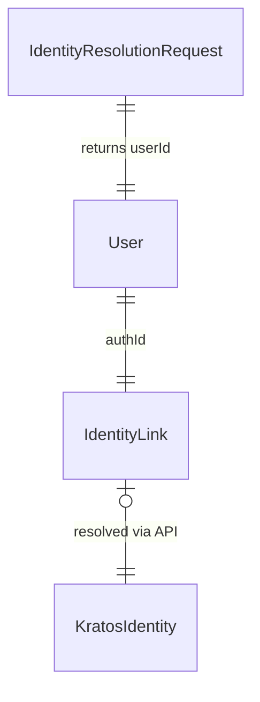

# Data Model: Kratos Identity Linkage

**Feature**: 014-kratos-authid
**Phase**: 1 – Design & Contracts
**Date**: 2025-11-08

## Overview

This feature extends the existing community user model to persist the Kratos identity identifier, enables lookup/provisioning through a private REST endpoint, and backfills historical data via a TypeORM migration. No new aggregate roots are introduced; instead, we augment existing entities and DTOs.

## Updated Domain Entities

### User (existing)

**Location**: `src/domain/community/user/user.entity.ts`

```typescript
@Column({ name: 'authId', type: 'char', length: 36, nullable: true, unique: true })
public authId?: string | null;
```

- **Purpose**: Stores the immutable Kratos identity identifier corresponding to the user.
- **Constraints**:
  - `unique: true` to enforce a one-to-one mapping between Kratos identities and Alkemio users.
  - Nullable during rollout; migration fills values and future creation paths must set it before completion.
- **Validation Rules**:
  - `UserService.createUserFromAgentInfo` updated to require a non-empty Kratos ID when provided by upstream flows.
  - An invariant check will prevent assigning an `authId` that already exists on another record (throws `ValidationException`).
- **Event/Webhook Impact**: Existing user-created events reuse the enriched entity; no schema change required for GraphQL because the field remains internal.

### Identity Link (conceptual)

Represented implicitly by the new `User.authId` column plus domain services.

- **Location**: Logic implemented inside `src/domain/community/user/user.service.ts` and `src/domain/community/user-lookup/user.lookup.service.ts`.
- **State**:
  - `authId: string` (required once set).
  - `status: 'synced' | 'missing' | 'duplicate-detected'` (transient, exposed via logs/metrics not persisted yet).
- **Transitions**:
  1. **Migrated** – set by TypeORM migration using Kratos admin API.
  2. **Provisioned** – set during new user creation or via identity resolution endpoint.
  3. **Exception** – if Kratos lookup fails, domain service emits an exception captured by REST layer for retry.

## Service & DTO Additions

### Identity Resolution REST Module

**Location**: `src/services/api-rest/identity-resolution/`

- `identity-resolution.controller.ts`
  - `POST /internal/identity/resolve`
  - Accepts body `IdentityResolutionRequestDto`.
- `identity-resolution.service.ts`
  - Orchestrates lookup/provision by invoking `UserService` and `KratosService`.
  - Emits audit logs and metrics.
- `identity-resolution.module.ts`
  - Registers controller/service, applies authentication guard for internal clients.

#### DTOs

**Location**: `src/services/api-rest/identity-resolution/dto/`

```typescript
export class IdentityResolutionRequestDto {
  @IsString()
  @IsNotEmpty()
  kratosIdentityId!: string;
}

export class IdentityResolutionResponseDto {
  @IsUUID()
  userId!: string;
  @IsBoolean()
  created!: boolean; // true when endpoint provisioned a new user
}
```

Validation leverages Nest pipe defaults (`class-validator`).

## Infrastructure Layer Updates

### KratosService

**Location**: `src/services/infrastructure/kratos/kratos.service.ts`

- Add method `getIdentityById(id: string): Promise<Identity | undefined>` using `IdentityApi.getIdentity`.
- Map identity traits to `AgentInfo` via existing `AuthenticationService.createAgentInfo`.
- Provide resilience (timeouts/retries) consistent with other methods.

## Migration Artifacts

### TypeORM Migration

**Location**: `src/migrations/20251108120000-user-auth-id.ts` (placeholder name)

Responsibilities:

1. **Schema**: `ALTER TABLE user ADD COLUMN authId VARCHAR(191) NULL UNIQUE` (InnoDB index length ≤191 for utf8mb4).
2. **Backfill**: For each user with verified email:
   - Query Kratos admin API for matching identity via email.
   - Persist `authId` when exactly one identity is found.
   - Record unresolved cases in a dedicated log table or JSON dump (temporary table `user_authid_backfill_audit`).
3. **Rollback**: Drop unique index/column and audit table if created.
4. **Idempotency**: Skip updates when `authId` already populated; reuse transaction boundaries.

## Data Validation & Testing

- **Unit Tests**: Add specs under `src/domain/community/user/__tests__/user.service.identity.spec.ts` covering duplicate detection and setter logic.
- **Integration Tests**: Add `tests/integration/identity-resolution.e2e-spec.ts` verifying REST endpoint behaviours (existing user, auto-provision, error).
- **Migration Tests**: Add `tests/migration/add-user-authid.migration.spec.ts` that runs migration up/down against snapshot using `.scripts/migrations` harness.



*Diagram is illustrative only; `IdentityLink` is stored directly on `User`.*
