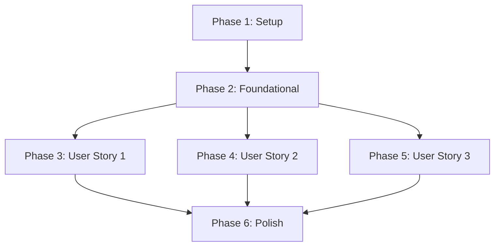

# Implementation Tasks: Default Callout Template for Flow Steps

**Feature**: 019-default-post-template-flow
**Branch**: `019-default-post-template-flow`
**Generated**: 2026-01-08
**Source**: [spec.md](./spec.md) | [plan.md](./plan.md) | [data-model.md](./data-model.md)

---

## Task Summary

- **Total Tasks**: 22
- **User Stories**: 3
- **Parallel Opportunities**: 7 tasks
- **MVP Scope**: User Story 1 (set default template)

---

## Implementation Strategy

**Incremental Delivery**:

1. MVP: User Story 1 (admin can set default template via GraphQL)
2. Complete: User Story 2 (admin can remove default template)
3. Full: User Story 3 (queries for frontend integration)

**Parallel Execution**:

- Within Setup: Migration can run while entity is being modified (different concerns)
- Within US1: DTOs can be created in parallel after service layer is ready
- Within US3: Field resolvers and query examples can be created in parallel

---

## Phase 1: Setup

**Goal**: Prepare database schema and entity model for storing default CALLOUT template references on flow steps.

### Tasks

- [x] T001 Add defaultCalloutTemplate relation to InnovationFlowState entity in src/domain/collaboration/innovation-flow-state/innovation.flow.state.entity.ts
- [x] T002 [P] Generate database migration using pnpm run migration:generate -n AddDefaultCalloutTemplateToFlowState
- [x] T003 Review and modify migration to add idempotent SQL (IF NOT EXISTS clauses) in src/migrations/[timestamp]-AddDefaultCalloutTemplateToFlowState.ts
- [x] T004 Test migration locally: run pnpm run migration:run and verify column exists, then test rollback with pnpm run migration:revert

---

## Phase 2: Foundational

**Goal**: Implement core service layer logic with validation rules that all user stories depend on.

### Tasks

- [x] T005 Add TemplateService dependency injection to InnovationFlowStateService in src/domain/collaboration/innovation-flow-state/innovation.flow.state.service.ts
- [x] T006 Add template type validation (must be CALLOUT) in InnovationFlowStateService at src/domain/collaboration/innovation-flow-state/innovation.flow.state.service.ts

---

## Phase 3: User Story 1 - Set Default Template

**Story**: As a Space admin, I want to set a default CALLOUT template for a flow step via GraphQL mutation, so that the configuration is stored and can be used by the frontend.

**Acceptance Criteria**:

- ✅ Admin can call `setDefaultCalloutTemplateOnInnovationFlowState` mutation
- ✅ Template type must be CALLOUT (validated)
- ✅ Template can be from space or platform library (no space boundary restriction)
- ✅ Only users with UPDATE_INNOVATION_FLOW privilege can execute
- ✅ Mutation returns updated InnovationFlowState with defaultCalloutTemplate loaded
- ✅ Structured logging captures success and validation failures

**Independent Test**:

```graphql
mutation TestSetTemplate {
  setDefaultCalloutTemplateOnInnovationFlowState(
    setData: {
      flowStateID: "<test-flow-state-id>"
      templateID: "<test-callout-template-id>"
    }
  ) {
    id
    defaultCalloutTemplate {
      id
      type
    }
  }
}
```

**Expected**: Returns flow state with template set. Verify in database: `SELECT "defaultCalloutTemplateId" FROM innovation_flow_state WHERE id = '<test-flow-state-id>'`

### Tasks

- [x] T007 [US1] Implement setDefaultCalloutTemplate method in InnovationFlowStateService at src/domain/collaboration/innovation-flow-state/innovation.flow.state.service.ts
- [x] T008 [P] [US1] Create SetDefaultCalloutTemplateOnInnovationFlowStateInput DTO in src/domain/collaboration/innovation-flow/dto/innovation.flow.dto.set.default.callout.template.ts
- [x] T009 [US1] Add setDefaultCalloutTemplateOnInnovationFlowState mutation resolver in src/domain/collaboration/innovation-flow/innovation.flow.resolver.mutations.ts
- [x] T010 [US1] Add authorization check (UPDATE_INNOVATION_FLOW privilege) in mutation resolver at src/domain/collaboration/innovation-flow/innovation.flow.resolver.mutations.ts
- [x] T011 [US1] Add structured logging (verbose on success, warning on validation error) in InnovationFlowStateService.setDefaultCalloutTemplate
- [ ] T012 [US1] Write unit test for setDefaultCalloutTemplate with valid CALLOUT template in src/domain/collaboration/innovation-flow-state/innovation.flow.state.service.spec.ts
- [ ] T013 [US1] Write unit test for setDefaultCalloutTemplate rejecting non-CALLOUT template in src/domain/collaboration/innovation-flow-state/innovation.flow.state.service.spec.ts

---

## Phase 4: User Story 2 - Remove Default Template

**Story**: As a Space admin, I want to remove the default CALLOUT template from a flow step via GraphQL mutation, so that members no longer see pre-filled content when adding posts.

**Acceptance Criteria**:

- ✅ Admin can call `removeDefaultCalloutTemplateOnInnovationFlowState` mutation
- ✅ Only users with UPDATE_INNOVATION_FLOW privilege can execute
- ✅ Mutation sets defaultCalloutTemplate to null
- ✅ Mutation returns updated InnovationFlowState
- ✅ Structured logging captures removal

**Independent Test**:

```graphql
mutation TestRemoveTemplate {
  removeDefaultCalloutTemplateOnInnovationFlowState(
    removeData: { flowStateID: "<test-flow-state-id>" }
  ) {
    id
    defaultCalloutTemplate {
      id
    }
  }
}
```

**Expected**: Returns flow state with `defaultCalloutTemplate: null`. Verify in database: `SELECT "defaultCalloutTemplateId" FROM innovation_flow_state WHERE id = '<test-flow-state-id>'` returns NULL.

### Tasks

- [x] T014 [US2] Implement removeDefaultCalloutTemplate method in InnovationFlowStateService at src/domain/collaboration/innovation-flow-state/innovation.flow.state.service.ts
- [x] T015 [P] [US2] Create RemoveDefaultCalloutTemplateOnInnovationFlowStateInput DTO in src/domain/collaboration/innovation-flow/dto/innovation.flow.dto.remove.default.callout.template.ts
- [x] T016 [US2] Add removeDefaultCalloutTemplateOnInnovationFlowState mutation resolver in src/domain/collaboration/innovation-flow/innovation.flow.resolver.mutations.ts
- [x] T017 [US2] Add authorization check (UPDATE_INNOVATION_FLOW privilege) in remove mutation resolver at src/domain/collaboration/innovation-flow/innovation.flow.resolver.mutations.ts
- [ ] T018 [US2] Write unit test for removeDefaultCalloutTemplate in src/domain/collaboration/innovation-flow-state/innovation.flow.state.service.spec.ts

---

## Phase 5: User Story 3 - Query Default Templates

**Story**: As a frontend developer, I need to query flow states with their default CALLOUT templates via GraphQL, so I can fetch the template ID and pre-fill the "Add Post" dialog.

**Acceptance Criteria**:

- ✅ InnovationFlowState GraphQL type includes defaultCalloutTemplate field (nullable)
- ✅ Field automatically resolves via TypeORM relation (no custom resolver needed)
- ✅ Frontend can query: `innovationFlow { currentState { defaultCalloutTemplate { id } } }`
- ✅ Returns null when no template is set
- ✅ Returns template when set

**Independent Test**:

```graphql
query TestQueryTemplate($spaceID: UUID!) {
  space(ID: $spaceID) {
    collaboration {
      innovationFlow {
        currentState {
          id
          defaultCalloutTemplate {
            id
            type
            callout {
              contributionDefaults {
                postDescription
              }
            }
          }
        }
      }
    }
  }
}
```

**Expected**: Returns current flow state with defaultCalloutTemplate (if set) or null (if not set).

### Tasks

- [x] T019 [P] [US3] Verify InnovationFlowState GraphQL type auto-generates defaultCalloutTemplate field from entity decorator (no code needed, just verification)
- [x] T020 [P] [US3] Create example GraphQL queries showing frontend integration in specs/019-default-post-template-flow/contracts/example-queries.graphql

---

## Phase 6: Polish & Cross-Cutting

**Goal**: Finalize schema contract, integration tests, and documentation.

### Tasks

- [x] T021 Generate and validate GraphQL schema changes: run pnpm run schema:print && pnpm run schema:sort && pnpm run schema:diff

---

## Dependency Graph



**Story Dependencies**:

- User Story 1, 2, 3 can be implemented in parallel after Foundational phase completes
- Polish phase requires all user stories to complete

---

## Parallel Execution Examples

### Phase 1: Setup

```bash
# T001 and T002 can run in parallel (different concerns)
# Terminal 1:
# Edit entity file (T001)

# Terminal 2:
pnpm run migration:generate -n AddDefaultCalloutTemplateToFlowState  # T002
```

### Phase 3: User Story 1

```bash
# After T007 completes, T008 and T009 can run in parallel
# Terminal 1:
# Create DTO file (T008)

# Terminal 2:
# Create mutation resolver (T009)
```

### Phase 5: User Story 3

```bash
# T019 and T020 can run in parallel (verification vs documentation)
# Terminal 1:
# Verify GraphQL type generation (T019)

# Terminal 2:
# Write example queries (T020)
```

---

## Testing Strategy

**Unit Tests** (per User Story):

- US1: T012, T013 (test service layer validation)
- US2: T018 (test service layer removal)
- US3: No unit tests (GraphQL auto-generation verified)

**Integration Tests** (optional, not in tasks):

- Create integration test for full mutation flow (set → query → remove)
- Test template deletion sets defaultCalloutTemplate to null (ON DELETE SET NULL behavior)
- Test Space template creation excludes defaultCalloutTemplateId

**Manual Testing** (see quickstart.md):

- Use GraphQL Playground to test mutations
- Verify database state with SQL queries
- Test authorization with non-admin user

---

## MVP Scope Recommendation

**Minimum Viable Product**: User Story 1 only

- Tasks: T001-T013 (Setup, Foundational, US1)
- Deliverable: Admins can set default CALLOUT templates via GraphQL
- Value: Core functionality is in place, can be tested end-to-end

**Full Feature**: All User Stories

- Tasks: T001-T021
- Deliverable: Complete backend support for default templates
- Value: Frontend integration ready, remove functionality available

---

## Notes

1. **Frontend Work Not Included**: This task list covers backend only. Frontend tasks (dialog UI, template loading, pre-fill logic) are in a separate repository.

2. **No Backend Logic in Post Creation**: Per updated requirements, template loading happens client-side. Backend only stores the configuration.

3. **Template Deletion Behavior**: Database constraint `ON DELETE SET NULL` handles template deletion automatically. No application code needed.

4. **Space Template Creation**: Exclusion of `defaultCalloutTemplateId` from space template exports is handled in existing space template creation logic (if needed, add task to verify/implement).

5. **Schema Contract**: Changes are non-breaking (nullable field, additive mutations). No deprecations required.

6. **Authorization**: All mutations use existing `UPDATE_INNOVATION_FLOW` privilege. No new authorization setup needed.

---

## Task Format Validation

✅ All tasks follow checklist format: `- [ ] TXXX [P?] [Story?] Description with file path`
✅ Sequential task IDs: T001-T021
✅ Parallel markers ([P]): 7 tasks marked
✅ Story labels ([US1], [US2], [US3]): Applied to story-specific tasks
✅ File paths: Included in all implementation tasks
✅ Updated: Removed space validation tasks (templates can be from space or platform library)
